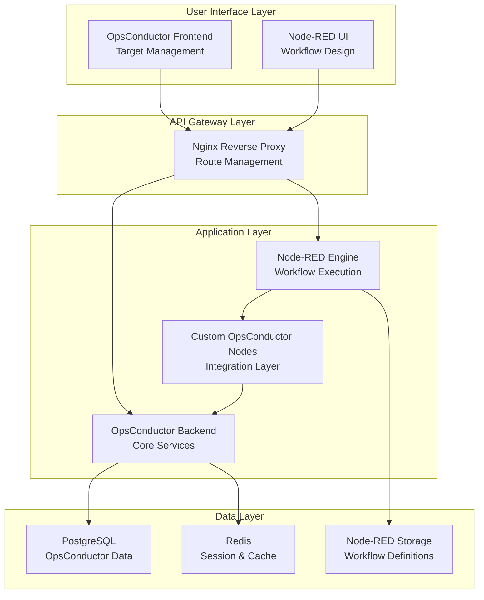
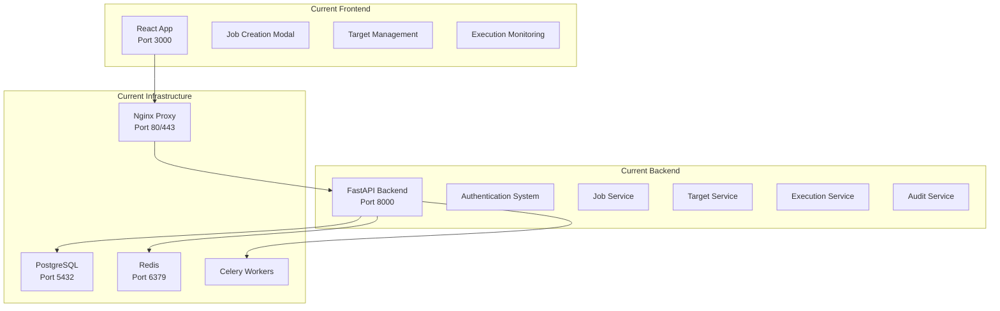
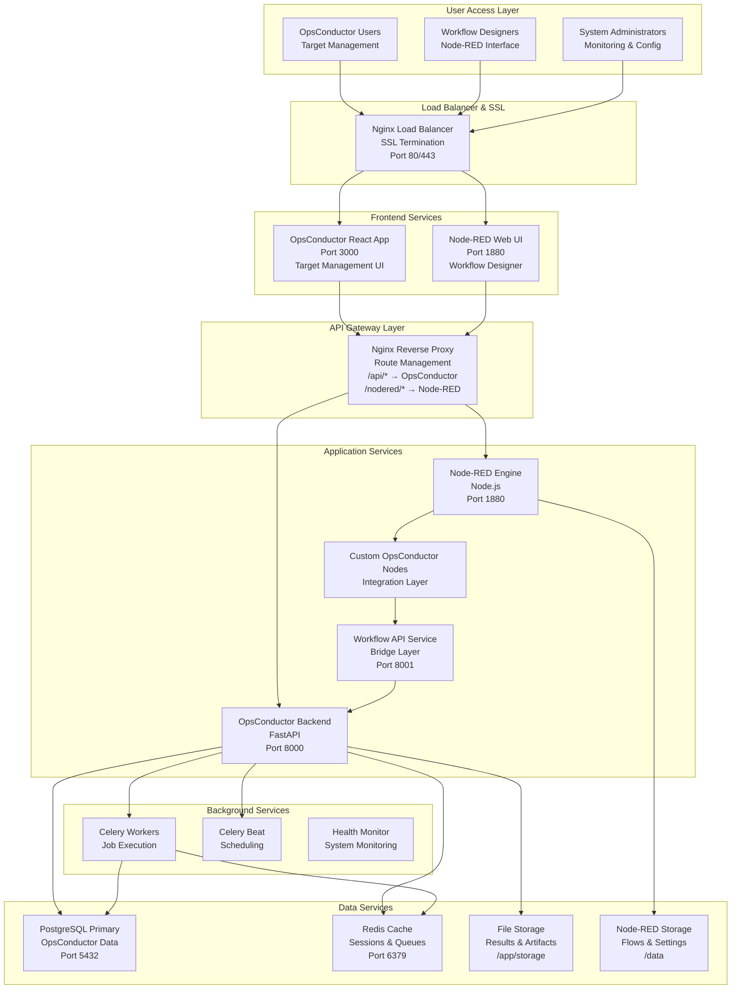
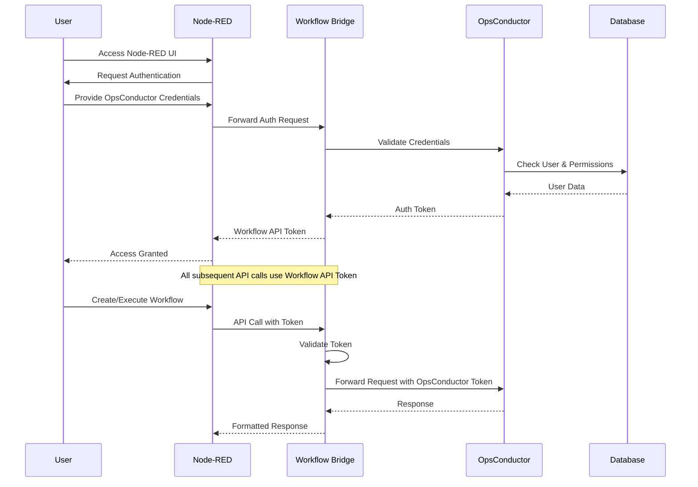
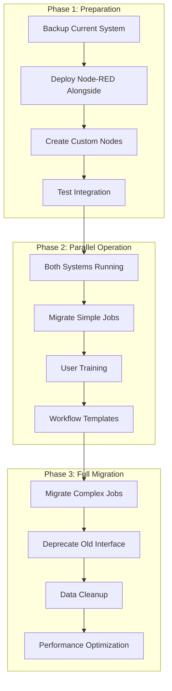
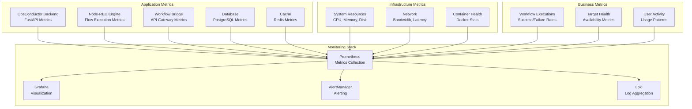

# **🚀 COMPREHENSIVE IMPLEMENTATION PLAN**
## **OpsConductor + Node-RED Integration**
### **Complete Microservices Architecture & Implementation Guide**

---

## **📋 TABLE OF CONTENTS**

1. [Executive Summary](#executive-summary)
2. [Current System Analysis](#current-system-analysis)
3. [Target Architecture](#target-architecture)
4. [Integration Strategy](#integration-strategy)
5. [Microservices Architecture](#microservices-architecture)
6. [Node-RED Custom Nodes](#node-red-custom-nodes)
7. [API Design & Specifications](#api-design--specifications)
8. [Database Schema Changes](#database-schema-changes)
9. [Security & Authentication](#security--authentication)
10. [Implementation Timeline](#implementation-timeline)
11. [Deployment Guide](#deployment-guide)
12. [Testing Strategy](#testing-strategy)
13. [Migration Plan](#migration-plan)
14. [Monitoring & Maintenance](#monitoring--maintenance)
15. [Risk Assessment](#risk-assessment)

---

## **📊 EXECUTIVE SUMMARY**

### **Project Overview**
This document outlines the complete integration of Node-RED as a visual workflow engine with the existing OpsConductor automation platform. The integration maintains OpsConductor's core strengths (target management, authentication, execution engine) while adding Node-RED's powerful visual workflow capabilities.

### **Key Objectives**
- **Preserve existing functionality** - All current OpsConductor features remain operational
- **Add visual workflow design** - Node-RED provides drag-and-drop workflow creation
- **Seamless integration** - Custom Node-RED nodes interact with OpsConductor APIs
- **Minimal development effort** - 4 weeks vs 6 months for custom solution
- **Enhanced user experience** - Professional workflow designer with extensive node ecosystem

### **Architecture Approach**


---

## **🔍 CURRENT SYSTEM ANALYSIS**

### **Existing OpsConductor Architecture**



### **Current Functionality Mapping**

#### **1. Authentication & User Management**
```python
# Current Location: backend/app/core/session_security.py
# Current Location: backend/app/api/v3/auth.py
# Current Location: backend/app/models/user_models.py

Functions to Preserve:
├── User login/logout
├── Session management (Redis-based)
├── JWT token creation/validation
├── Password hashing/verification
├── User role management
└── Audit logging
```

#### **2. Target Management**
```python
# Current Location: backend/app/models/universal_target_models.py
# Current Location: backend/app/api/v3/targets.py
# Current Location: backend/app/services/target_service.py

Functions to Preserve:
├── Universal target CRUD operations
├── Target health monitoring
├── Credential management (encrypted)
├── Connection testing (SSH/WinRM)
├── Target grouping and filtering
└── Target discovery
```

#### **3. Job Management**
```python
# Current Location: backend/app/models/job_models.py
# Current Location: backend/app/api/v3/jobs.py
# Current Location: backend/app/services/job_service.py

Functions to Transform:
├── Job creation (form-based → Node-RED workflows)
├── Job scheduling (basic cron → Node-RED triggers)
├── Job execution (linear → workflow-based)
├── Results storage (database TEXT → file-based)
└── Execution monitoring (basic → visual)
```

#### **4. Execution Engine**
```python
# Current Location: backend/app/services/job_execution_service.py
# Current Location: backend/app/tasks/job_tasks.py
# Current Location: backend/app/utils/connection_test_utils.py

Functions to Enhance:
├── SSH command execution
├── WinRM command execution
├── File transfer operations
├── Parallel target execution
├── Error handling and retries
└── Results collection
```

---

## **🎯 TARGET ARCHITECTURE**

### **Complete System Architecture**



---

## **🏗️ MICROSERVICES ARCHITECTURE**

### **Service Breakdown**

#### **1. OpsConductor Core Service (Enhanced)**
```yaml
Service: opsconductor-backend
Port: 8000
Technology: FastAPI + Python 3.11
Database: PostgreSQL (opsconductor_db)
Cache: Redis

Responsibilities:
├── User authentication & authorization
├── Target management (CRUD, health, credentials)
├── Job execution engine (SSH/WinRM)
├── Results storage and retrieval
├── Audit logging and compliance
├── System health monitoring
└── Legacy job support (backward compatibility)

New API Endpoints for Node-RED:
├── GET /api/workflow/targets - Target list for Node-RED
├── POST /api/workflow/execute - Execute commands via Node-RED
├── GET /api/workflow/results/{id} - Get execution results
├── POST /api/workflow/auth - Authenticate Node-RED requests
└── GET /api/workflow/health - Health check for Node-RED
```

#### **2. Node-RED Workflow Engine**
```yaml
Service: nodered-engine
Port: 1880
Technology: Node.js + Node-RED
Storage: File-based (/data volume)
Custom Nodes: OpsConductor integration nodes

Responsibilities:
├── Visual workflow designer interface
├── Workflow execution engine
├── Flow state management
├── Node palette management
├── Custom node loading
├── Webhook endpoints
└── Flow import/export

Custom OpsConductor Nodes:
├── opsconductor-target-selector
├── opsconductor-command-executor
├── opsconductor-file-transfer
├── opsconductor-health-check
├── opsconductor-audit-logger
└── opsconductor-notification
```

#### **3. Workflow API Bridge Service (New)**
```yaml
Service: workflow-api-bridge
Port: 8001
Technology: FastAPI + Python 3.11
Purpose: Bridge between Node-RED and OpsConductor

Responsibilities:
├── API translation (Node-RED ↔ OpsConductor)
├── Authentication proxy for Node-RED
├── Data format conversion
├── Error handling and logging
├── Rate limiting and throttling
├── Request validation
└── Response caching

Key Functions:
├── Translate Node-RED requests to OpsConductor API calls
├── Handle authentication tokens
├── Format responses for Node-RED consumption
├── Provide simplified API for custom nodes
└── Manage workflow execution state
```

---

## **🔧 NODE-RED CUSTOM NODES**

### **1. OpsConductor Target Selector Node**

```javascript
// File: nodered/custom-nodes/opsconductor-target-selector/opsconductor-target-selector.js

module.exports = function(RED) {
    "use strict";
    
    function OpsConductorTargetSelector(config) {
        RED.nodes.createNode(this, config);
        var node = this;
        
        // Node configuration
        this.name = config.name;
        this.targetFilter = config.targetFilter || {};
        this.selectedTargets = config.selectedTargets || [];
        this.outputFormat = config.outputFormat || 'array';
        
        // API configuration
        this.apiUrl = process.env.OPSCONDUCTOR_API_URL || 'http://workflow-api-bridge:8001';
        this.apiToken = process.env.OPSCONDUCTOR_TOKEN;
        
        node.on('input', async function(msg, send, done) {
            try {
                node.status({fill: "blue", shape: "dot", text: "fetching targets..."});
                
                // Build query parameters
                let queryParams = new URLSearchParams();
                
                // Apply filters from configuration
                if (config.targetFilter.osType) {
                    queryParams.append('os_type', config.targetFilter.osType);
                }
                if (config.targetFilter.environment) {
                    queryParams.append('environment', config.targetFilter.environment);
                }
                if (config.targetFilter.status) {
                    queryParams.append('status', config.targetFilter.status);
                }
                
                // Apply dynamic filters from input message
                if (msg.targetFilter) {
                    Object.keys(msg.targetFilter).forEach(key => {
                        queryParams.append(key, msg.targetFilter[key]);
                    });
                }
                
                // Make API request
                const response = await fetch(`${node.apiUrl}/api/workflow/targets?${queryParams}`, {
                    method: 'GET',
                    headers: {
                        'Authorization': `Bearer ${node.apiToken}`,
                        'Content-Type': 'application/json',
                        'User-Agent': 'Node-RED OpsConductor Integration'
                    }
                });
                
                if (!response.ok) {
                    throw new Error(`API request failed: ${response.status} ${response.statusText}`);
                }
                
                const data = await response.json();
                let targets = data.targets || [];
                
                // Apply specific target selection if configured
                if (config.selectedTargets && config.selectedTargets.length > 0) {
                    targets = targets.filter(target => 
                        config.selectedTargets.includes(target.id.toString())
                    );
                }
                
                // Format output based on configuration
                let output;
                switch (config.outputFormat) {
                    case 'array':
                        output = targets;
                        break;
                    case 'ids':
                        output = targets.map(t => t.id);
                        break;
                    case 'names':
                        output = targets.map(t => t.name);
                        break;
                    case 'detailed':
                        output = {
                            targets: targets,
                            count: targets.length,
                            filters_applied: config.targetFilter,
                            timestamp: new Date().toISOString()
                        };
                        break;
                    default:
                        output = targets;
                }
                
                // Set output message
                msg.payload = output;
                msg.targets = targets;
                msg.targetCount = targets.length;
                msg.targetIds = targets.map(t => t.id);
                
                node.status({
                    fill: "green", 
                    shape: "dot", 
                    text: `${targets.length} targets selected`
                });
                
                send(msg);
                done();
                
            } catch (error) {
                node.status({fill: "red", shape: "ring", text: "error"});
                node.error(`Target selection failed: ${error.message}`, msg);
                done(error);
            }
        });
        
        // Cleanup on node removal
        node.on('close', function() {
            node.status({});
        });
    }
    
    RED.nodes.registerType("opsconductor-target-selector", OpsConductorTargetSelector);
};
```

### **2. OpsConductor Command Executor Node**

```javascript
// File: nodered/custom-nodes/opsconductor-command-executor/opsconductor-command-executor.js

module.exports = function(RED) {
    "use strict";
    
    function OpsConductorCommandExecutor(config) {
        RED.nodes.createNode(this, config);
        var node = this;
        
        // Node configuration
        this.name = config.name;
        this.command = config.command;
        this.timeout = parseInt(config.timeout) || 30;
        this.retryCount = parseInt(config.retryCount) || 0;
        this.continueOnFailure = config.continueOnFailure || false;
        this.outputFormat = config.outputFormat || 'detailed';
        
        // API configuration
        this.apiUrl = process.env.OPSCONDUCTOR_API_URL || 'http://workflow-api-bridge:8001';
        this.apiToken = process.env.OPSCONDUCTOR_TOKEN;
        
        node.on('input', async function(msg, send, done) {
            try {
                // Validate inputs
                const targets = msg.targets || msg.payload;
                if (!targets || !Array.isArray(targets) || targets.length === 0) {
                    throw new Error('No targets provided. Connect this node to a target selector node.');
                }
                
                const command = config.command || msg.command;
                if (!command) {
                    throw new Error('No command specified. Configure the command in node settings or pass via msg.command.');
                }
                
                node.status({
                    fill: "blue", 
                    shape: "dot", 
                    text: `executing on ${targets.length} targets...`
                });
                
                // Prepare execution request
                const executionRequest = {
                    name: `Node-RED: ${config.name || 'Command Execution'}`,
                    description: `Executed via Node-RED workflow: ${command}`,
                    actions: [{
                        action_type: 'command',
                        action_name: 'Execute Command',
                        action_parameters: {
                            command: command,
                            timeout: node.timeout,
                            retry_count: node.retryCount
                        }
                    }],
                    target_ids: targets.map(t => typeof t === 'object' ? t.id : t),
                    execute_immediately: true,
                    workflow_context: {
                        node_red_flow_id: msg._msgid,
                        node_id: node.id,
                        node_name: node.name
                    }
                };
                
                // Execute command via API
                const response = await fetch(`${node.apiUrl}/api/workflow/execute`, {
                    method: 'POST',
                    headers: {
                        'Authorization': `Bearer ${node.apiToken}`,
                        'Content-Type': 'application/json',
                        'User-Agent': 'Node-RED OpsConductor Integration'
                    },
                    body: JSON.stringify(executionRequest)
                });
                
                if (!response.ok) {
                    const errorData = await response.json().catch(() => ({}));
                    throw new Error(`Execution request failed: ${response.status} ${response.statusText}. ${errorData.detail || ''}`);
                }
                
                const executionData = await response.json();
                const executionId = executionData.execution_id;
                
                node.status({
                    fill: "yellow", 
                    shape: "dot", 
                    text: `waiting for results...`
                });
                
                // Wait for execution completion
                const results = await node.waitForExecution(executionId);
                
                // Process results
                const successfulTargets = results.filter(r => r.status === 'completed' && r.exit_code === 0);
                const failedTargets = results.filter(r => r.status === 'failed' || r.exit_code !== 0);
                
                // Format output based on configuration
                let output;
                switch (config.outputFormat) {
                    case 'summary':
                        output = {
                            execution_id: executionId,
                            command: command,
                            total_targets: results.length,
                            successful: successfulTargets.length,
                            failed: failedTargets.length,
                            success_rate: (successfulTargets.length / results.length * 100).toFixed(1) + '%'
                        };
                        break;
                    case 'results_only':
                        output = results.map(r => ({
                            target_name: r.target_name,
                            status: r.status,
                            exit_code: r.exit_code,
                            output: r.output_text,
                            error: r.error_text
                        }));
                        break;
                    case 'detailed':
                    default:
                        output = {
                            execution_id: executionId,
                            command: command,
                            execution_time: executionData.execution_time,
                            summary: {
                                total_targets: results.length,
                                successful: successfulTargets.length,
                                failed: failedTargets.length,
                                success_rate: (successfulTargets.length / results.length * 100).toFixed(1) + '%'
                            },
                            results: results,
                            successful_targets: successfulTargets,
                            failed_targets: failedTargets
                        };
                        break;
                }
                
                // Set output message
                msg.payload = output;
                msg.executionId = executionId;
                msg.results = results;
                msg.successfulTargets = successfulTargets;
                msg.failedTargets = failedTargets;
                msg.command = command;
                
                // Update node status
                if (failedTargets.length === 0) {
                    node.status({
                        fill: "green", 
                        shape: "dot", 
                        text: `success: ${successfulTargets.length}/${results.length}`
                    });
                } else if (successfulTargets.length === 0) {
                    node.status({
                        fill: "red", 
                        shape: "dot", 
                        text: `failed: ${failedTargets.length}/${results.length}`
                    });
                } else {
                    node.status({
                        fill: "yellow", 
                        shape: "dot", 
                        text: `mixed: ${successfulTargets.length}/${results.length} success`
                    });
                }
                
                // Handle failures
                if (failedTargets.length > 0 && !node.continueOnFailure) {
                    const error = new Error(`Command execution failed on ${failedTargets.length} targets`);
                    error.results = results;
                    error.failedTargets = failedTargets;
                    done(error);
                    return;
                }
                
                send(msg);
                done();
                
            } catch (error) {
                node.status({fill: "red", shape: "ring", text: "error"});
                node.error(`Command execution failed: ${error.message}`, msg);
                done(error);
            }
        });
        
        // Helper method to wait for execution completion
        this.waitForExecution = async function(executionId) {
            const maxAttempts = Math.ceil(node.timeout * 2); // Check every 5 seconds
            let attempts = 0;
            
            while (attempts < maxAttempts) {
                try {
                    const statusResponse = await fetch(`${node.apiUrl}/api/workflow/results/${executionId}`, {
                        headers: {
                            'Authorization': `Bearer ${node.apiToken}`,
                            'Content-Type': 'application/json'
                        }
                    });
                    
                    if (!statusResponse.ok) {
                        throw new Error(`Failed to get execution status: ${statusResponse.status}`);
                    }
                    
                    const statusData = await statusResponse.json();
                    const results = statusData.results || [];
                    
                    // Check if all targets completed
                    const pendingResults = results.filter(r => 
                        r.status === 'running' || r.status === 'scheduled'
                    );
                    
                    if (pendingResults.length === 0 && results.length > 0) {
                        return results;
                    }
                    
                    // Update status with progress
                    const completedCount = results.length - pendingResults.length;
                    if (results.length > 0) {
                        node.status({
                            fill: "blue", 
                            shape: "dot", 
                            text: `progress: ${completedCount}/${results.length}`
                        });
                    }
                    
                    // Wait before next check
                    await new Promise(resolve => setTimeout(resolve, 5000));
                    attempts++;
                    
                } catch (error) {
                    console.error(`Error checking execution status: ${error.message}`);
                    attempts++;
                    await new Promise(resolve => setTimeout(resolve, 5000));
                }
            }
            
            throw new Error(`Execution timeout after ${node.timeout * 2 * 5} seconds`);
        };
        
        // Cleanup on node removal
        node.on('close', function() {
            node.status({});
        });
    }
    
    RED.nodes.registerType("opsconductor-command-executor", OpsConductorCommandExecutor);
};
```

---

## **🔐 SECURITY & AUTHENTICATION**

### **Authentication Flow**



---

## **📊 DATABASE SCHEMA CHANGES**

### **New Tables for Workflow Integration**

```sql
-- File: database/migrations/add_workflow_integration.sql

-- Workflow execution tracking
CREATE TABLE workflow_executions (
    id SERIAL PRIMARY KEY,
    node_red_flow_id VARCHAR(255),
    execution_id INTEGER REFERENCES job_executions(id),
    workflow_name VARCHAR(255) NOT NULL,
    workflow_version VARCHAR(50),
    node_id VARCHAR(255),
    node_name VARCHAR(255),
    user_id INTEGER REFERENCES users(id),
    status VARCHAR(50) NOT NULL DEFAULT 'running',
    started_at TIMESTAMP WITH TIME ZONE DEFAULT NOW(),
    completed_at TIMESTAMP WITH TIME ZONE,
    error_message TEXT,
    metadata JSONB,
    created_at TIMESTAMP WITH TIME ZONE DEFAULT NOW()
);

-- Workflow tokens for authentication
CREATE TABLE workflow_tokens (
    id SERIAL PRIMARY KEY,
    token_hash VARCHAR(255) UNIQUE NOT NULL,
    user_id INTEGER REFERENCES users(id),
    created_at TIMESTAMP WITH TIME ZONE DEFAULT NOW(),
    expires_at TIMESTAMP WITH TIME ZONE NOT NULL,
    last_used_at TIMESTAMP WITH TIME ZONE,
    is_active BOOLEAN DEFAULT true
);

-- Node-RED flow storage (backup/versioning)
CREATE TABLE nodered_flows (
    id SERIAL PRIMARY KEY,
    flow_id VARCHAR(255) UNIQUE NOT NULL,
    flow_name VARCHAR(255) NOT NULL,
    flow_data JSONB NOT NULL,
    version INTEGER DEFAULT 1,
    user_id INTEGER REFERENCES users(id),
    is_active BOOLEAN DEFAULT true,
    created_at TIMESTAMP WITH TIME ZONE DEFAULT NOW(),
    updated_at TIMESTAMP WITH TIME ZONE DEFAULT NOW()
);

-- Workflow templates
CREATE TABLE workflow_templates (
    id SERIAL PRIMARY KEY,
    name VARCHAR(255) NOT NULL,
    description TEXT,
    category VARCHAR(100),
    template_data JSONB NOT NULL,
    author_id INTEGER REFERENCES users(id),
    is_public BOOLEAN DEFAULT false,
    download_count INTEGER DEFAULT 0,
    rating DECIMAL(3,2),
    created_at TIMESTAMP WITH TIME ZONE DEFAULT NOW(),
    updated_at TIMESTAMP WITH TIME ZONE DEFAULT NOW()
);

-- Indexes for performance
CREATE INDEX idx_workflow_executions_node_red_flow_id ON workflow_executions(node_red_flow_id);
CREATE INDEX idx_workflow_executions_execution_id ON workflow_executions(execution_id);
CREATE INDEX idx_workflow_executions_user_id ON workflow_executions(user_id);
CREATE INDEX idx_workflow_executions_status ON workflow_executions(status);
CREATE INDEX idx_workflow_executions_created_at ON workflow_executions(created_at);

CREATE INDEX idx_workflow_tokens_user_id ON workflow_tokens(user_id);
CREATE INDEX idx_workflow_tokens_expires_at ON workflow_tokens(expires_at);
CREATE INDEX idx_workflow_tokens_is_active ON workflow_tokens(is_active);

CREATE INDEX idx_nodered_flows_flow_id ON nodered_flows(flow_id);
CREATE INDEX idx_nodered_flows_user_id ON nodered_flows(user_id);
CREATE INDEX idx_nodered_flows_is_active ON nodered_flows(is_active);

CREATE INDEX idx_workflow_templates_category ON workflow_templates(category);
CREATE INDEX idx_workflow_templates_is_public ON workflow_templates(is_public);
CREATE INDEX idx_workflow_templates_author_id ON workflow_templates(author_id);
```

---

## **🚀 IMPLEMENTATION TIMELINE**

### **Phase 1: Foundation Setup (Week 1-2)**

#### **Week 1: Infrastructure & Basic Integration**

**Day 1-2: Environment Setup**
```bash
# Tasks:
1. Update docker-compose.yml with Node-RED service
2. Create workflow-bridge service structure
3. Set up development environment
4. Configure nginx routing for Node-RED

# Deliverables:
- Node-RED accessible at /nodered/
- Workflow bridge service running
- Basic routing configured
- Development environment ready
```

**Day 3-4: Authentication Integration**
```bash
# Tasks:
1. Implement workflow token system in OpsConductor
2. Create Node-RED authentication strategy
3. Set up secure communication between services
4. Test authentication flow

# Deliverables:
- Workflow tokens working
- Node-RED authentication with OpsConductor
- Secure API communication
- Authentication tests passing
```

**Day 5-7: Basic Custom Nodes**
```bash
# Tasks:
1. Create opsconductor-target-selector node
2. Create opsconductor-command-executor node
3. Implement workflow API bridge endpoints
4. Test basic workflow execution

# Deliverables:
- 2 working custom nodes
- API bridge functional
- Basic workflow execution working
- Integration tests passing
```

#### **Week 2: Enhanced Functionality**

**Day 8-10: Advanced Nodes**
```bash
# Tasks:
1. Create opsconductor-file-transfer node
2. Create opsconductor-health-check node
3. Create opsconductor-audit-logger node
4. Implement error handling and retry logic

# Deliverables:
- 5 total custom nodes
- Comprehensive error handling
- Retry mechanisms working
- Node documentation complete
```

**Day 11-12: Database Integration**
```bash
# Tasks:
1. Implement workflow execution tracking
2. Add workflow templates system
3. Create flow backup/versioning
4. Database migration scripts

# Deliverables:
- Workflow tracking in database
- Template system functional
- Flow versioning working
- Migration scripts tested
```

**Day 13-14: Testing & Documentation**
```bash
# Tasks:
1. Comprehensive integration testing
2. Performance testing
3. Security testing
4. User documentation

# Deliverables:
- All tests passing
- Performance benchmarks met
- Security audit complete
- Documentation ready
```

### **Phase 2: Production Readiness (Week 3-4)**

#### **Week 3: Advanced Features**

**Day 15-17: Enhanced UI/UX**
```bash
# Tasks:
1. Custom Node-RED theme with OpsConductor branding
2. Enhanced node configuration interfaces
3. Workflow templates library
4. Import/export functionality

# Deliverables:
- Branded Node-RED interface
- Professional node UIs
- Template library functional
- Import/export working
```

**Day 18-19: Monitoring & Logging**
```bash
# Tasks:
1. Implement comprehensive logging
2. Add workflow execution monitoring
3. Create performance metrics
4. Set up alerting

# Deliverables:
- Structured logging implemented
- Monitoring dashboard
- Performance metrics tracked
- Alerting configured
```

**Day 20-21: Security Hardening**
```bash
# Tasks:
1. Security audit and fixes
2. Rate limiting implementation
3. Input validation enhancement
4. SSL/TLS configuration

# Deliverables:
- Security vulnerabilities fixed
- Rate limiting active
- Input validation comprehensive
- SSL properly configured
```

#### **Week 4: Deployment & Training**

**Day 22-24: Production Deployment**
```bash
# Tasks:
1. Production environment setup
2. Data migration from development
3. Load testing
4. Backup and recovery testing

# Deliverables:
- Production environment ready
- Data successfully migrated
- Load tests passed
- Backup/recovery verified
```

**Day 25-26: User Training**
```bash
# Tasks:
1. Create training materials
2. Conduct user training sessions
3. Create workflow examples
4. Set up support documentation

# Deliverables:
- Training materials complete
- Users trained on new system
- Example workflows available
- Support documentation ready
```

**Day 27-28: Go-Live & Support**
```bash
# Tasks:
1. Production go-live
2. Monitor system performance
3. User support and bug fixes
4. Performance optimization

# Deliverables:
- System live in production
- Performance monitoring active
- User issues resolved
- System optimized
```

---

## **📋 DEPLOYMENT GUIDE**

### **Production Docker Compose**

```yaml
# File: docker-compose.prod.yml

version: '3.8'

services:
  # ============================================================================
  # LOAD BALANCER
  # ============================================================================
  
  nginx:
    image: nginx:alpine
    container_name: opsconductor-nginx
    ports:
      - "80:80"
      - "443:443"
    volumes:
      - ./nginx/nginx.conf:/etc/nginx/nginx.conf
      - ./nginx/conf.d:/etc/nginx/conf.d
      - ./nginx/ssl:/etc/nginx/ssl
      - ./frontend/build:/usr/share/nginx/html
    networks: [opsconductor-network]
    depends_on: [opsconductor-backend, nodered-engine, frontend]
    restart: unless-stopped

  # ============================================================================
  # APPLICATION SERVICES
  # ============================================================================
  
  opsconductor-backend:
    build: 
      context: ./backend
      dockerfile: Dockerfile.prod
    container_name: opsconductor-backend
    ports: ["8000:8000"]
    environment:
      - DATABASE_URL=${DATABASE_URL}
      - REDIS_URL=${REDIS_URL}
      - SECRET_KEY=${SECRET_KEY}
      - ENABLE_WORKFLOW_API=true
      - WORKFLOW_API_TOKEN=${WORKFLOW_API_TOKEN}
    volumes:
      - opsconductor_storage:/app/storage
      - ./logs:/app/logs
    networks: [opsconductor-network]
    depends_on: [postgres, redis]
    restart: unless-stopped
    healthcheck:
      test: ["CMD", "curl", "-f", "http://localhost:8000/health"]
      interval: 30s
      timeout: 10s
      retries: 3

  nodered-engine:
    image: nodered/node-red:3.1.0
    container_name: opsconductor-nodered
    ports: ["1880:1880"]
    environment:
      - NODE_RED_ENABLE_PROJECTS=true
      - OPSCONDUCTOR_API_URL=http://workflow-api-bridge:8001
      - OPSCONDUCTOR_TOKEN=${WORKFLOW_API_TOKEN}
    volumes:
      - nodered_data:/data
      - ./nodered/custom-nodes:/data/node_modules/@opsconductor
      - ./nodered/settings.prod.js:/data/settings.js
    networks: [opsconductor-network]
    depends_on: [workflow-api-bridge]
    restart: unless-stopped
    healthcheck:
      test: ["CMD", "curl", "-f", "http://localhost:1880/"]
      interval: 30s
      timeout: 10s
      retries: 3

  workflow-api-bridge:
    build:
      context: ./workflow-bridge
      dockerfile: Dockerfile.prod
    container_name: opsconductor-workflow-bridge
    ports: ["8001:8001"]
    environment:
      - OPSCONDUCTOR_BACKEND_URL=http://opsconductor-backend:8000
      - REDIS_URL=${REDIS_URL}
      - API_TOKEN=${WORKFLOW_API_TOKEN}
    networks: [opsconductor-network]
    depends_on: [opsconductor-backend]
    restart: unless-stopped
    healthcheck:
      test: ["CMD", "curl", "-f", "http://localhost:8001/health"]
      interval: 30s
      timeout: 10s
      retries: 3

  # ============================================================================
  # DATABASE SERVICES
  # ============================================================================
  
  postgres:
    image: postgres:15-alpine
    container_name: opsconductor-postgres
    environment:
      POSTGRES_DB: ${POSTGRES_DB}
      POSTGRES_USER: ${POSTGRES_USER}
      POSTGRES_PASSWORD: ${POSTGRES_PASSWORD}
    volumes:
      - postgres_data:/var/lib/postgresql/data
      - ./database/init.sql:/docker-entrypoint-initdb.d/init.sql
    networks: [opsconductor-network]
    restart: unless-stopped
    healthcheck:
      test: ["CMD-SHELL", "pg_isready -U ${POSTGRES_USER} -d ${POSTGRES_DB}"]
      interval: 30s
      timeout: 10s
      retries: 5

  redis:
    image: redis:7-alpine
    container_name: opsconductor-redis
    command: redis-server --appendonly yes
    volumes:
      - redis_data:/data
    networks: [opsconductor-network]
    restart: unless-stopped
    healthcheck:
      test: ["CMD", "redis-cli", "ping"]
      interval: 30s
      timeout: 10s
      retries: 3

  # ============================================================================
  # BACKGROUND SERVICES
  # ============================================================================
  
  celery-worker:
    build:
      context: ./backend
      dockerfile: Dockerfile.prod
    container_name: opsconductor-celery-worker
    command: celery -A app.celery_app worker --loglevel=info --concurrency=4
    environment:
      - DATABASE_URL=${DATABASE_URL}
      - REDIS_URL=${REDIS_URL}
    volumes:
      - opsconductor_storage:/app/storage
      - ./logs:/app/logs
    networks: [opsconductor-network]
    depends_on: [postgres, redis]
    restart: unless-stopped

  celery-beat:
    build:
      context: ./backend
      dockerfile: Dockerfile.prod
    container_name: opsconductor-celery-beat
    command: celery -A app.celery_app beat --loglevel=info
    environment:
      - DATABASE_URL=${DATABASE_URL}
      - REDIS_URL=${REDIS_URL}
    volumes:
      - ./logs:/app/logs
    networks: [opsconductor-network]
    depends_on: [postgres, redis]
    restart: unless-stopped

  # ============================================================================
  # MONITORING
  # ============================================================================
  
  prometheus:
    image: prom/prometheus:latest
    container_name: opsconductor-prometheus
    ports: ["9090:9090"]
    volumes:
      - ./monitoring/prometheus.yml:/etc/prometheus/prometheus.yml
      - prometheus_data:/prometheus
    networks: [opsconductor-network]
    restart: unless-stopped

  grafana:
    image: grafana/grafana:latest
    container_name: opsconductor-grafana
    ports: ["3001:3000"]
    environment:
      - GF_SECURITY_ADMIN_PASSWORD=${GRAFANA_PASSWORD}
    volumes:
      - grafana_data:/var/lib/grafana
    networks: [opsconductor-network]
    depends_on: [prometheus]
    restart: unless-stopped

# ============================================================================
# NETWORKS AND VOLUMES
# ============================================================================

networks:
  opsconductor-network:
    driver: bridge

volumes:
  postgres_data:
    driver: local
  redis_data:
    driver: local
  nodered_data:
    driver: local
  opsconductor_storage:
    driver: local
  prometheus_data:
    driver: local
  grafana_data:
    driver: local
```

---

## **📊 MIGRATION PLAN**

### **Migration Strategy Overview**



### **Data Migration Scripts**

#### **Job Migration Script**
```python
# File: migration/migrate_jobs_to_workflows.py

import asyncio
import json
from sqlalchemy.orm import Session
from app.database.database import get_db
from app.models.job_models import Job, JobAction
from app.models.workflow_models import NodeRedFlow
import httpx

class JobToWorkflowMigrator:
    """Migrate existing jobs to Node-RED workflows."""
    
    def __init__(self, db: Session, nodered_url: str):
        self.db = db
        self.nodered_url = nodered_url
        self.migration_log = []
    
    def convert_job_to_workflow(self, job: Job) -> dict:
        """Convert a job to Node-RED workflow format."""
        
        # Generate unique IDs for nodes
        flow_id = f"migrated-job-{job.id}"
        target_selector_id = f"target-selector-{job.id}"
        
        # Base workflow structure
        workflow = {
            "flows": [
                {
                    "id": flow_id,
                    "type": "tab",
                    "label": f"Migrated: {job.name}",
                    "info": f"Migrated from job ID {job.id}\nOriginal description: {job.description or 'N/A'}"
                }
            ]
        }
        
        # Add target selector node
        target_selector = {
            "id": target_selector_id,
            "type": "opsconductor-target-selector",
            "z": flow_id,
            "name": "Target Selection",
            "selectedTargets": [str(tid) for tid in job.target_ids],
            "outputFormat": "array",
            "x": 100,
            "y": 100,
            "wires": []
        }
        
        workflow["flows"].append(target_selector)
        
        # Convert actions to nodes
        previous_node_id = target_selector_id
        x_position = 300
        
        for i, action in enumerate(job.actions):
            action_node_id = f"action-{job.id}-{i}"
            
            # Convert action based on type
            if action.action_type == 'command':
                action_node = {
                    "id": action_node_id,
                    "type": "opsconductor-command-executor",
                    "z": flow_id,
                    "name": action.action_name or f"Command {i+1}",
                    "command": action.action_parameters.get('command', ''),
                    "timeout": action.action_parameters.get('timeout', 30),
                    "retryCount": action.action_parameters.get('retry_count', 0),
                    "outputFormat": "detailed",
                    "x": x_position,
                    "y": 100,
                    "wires": []
                }
                
                # Connect to previous node
                for flow_node in workflow["flows"]:
                    if flow_node.get("id") == previous_node_id:
                        if "wires" not in flow_node:
                            flow_node["wires"] = [[]]
                        flow_node["wires"][0].append(action_node_id)
                        break
                
                workflow["flows"].append(action_node)
                previous_node_id = action_node_id
                x_position += 200
        
        return workflow
    
    async def migrate_job(self, job: Job) -> bool:
        """Migrate a single job to Node-RED workflow."""
        try:
            # Convert job to workflow
            workflow = self.convert_job_to_workflow(job)
            
            # Deploy workflow to Node-RED
            async with httpx.AsyncClient() as client:
                response = await client.post(
                    f"{self.nodered_url}/flows",
                    json=workflow,
                    headers={"Content-Type": "application/json"}
                )
                
                if response.status_code == 204:
                    # Store workflow in database
                    flow_record = NodeRedFlow(
                        flow_id=workflow["flows"][0]["id"],
                        flow_name=f"Migrated: {job.name}",
                        flow_data=workflow,
                        user_id=job.created_by_user_id,
                        version=1
                    )
                    
                    self.db.add(flow_record)
                    self.db.commit()
                    
                    self.migration_log.append({
                        'job_id': job.id,
                        'job_name': job.name,
                        'status': 'success',
                        'flow_id': workflow["flows"][0]["id"]
                    })
                    
                    return True
                else:
                    self.migration_log.append({
                        'job_id': job.id,
                        'job_name': job.name,
                        'status': 'failed',
                        'error': f"Node-RED deployment failed: {response.status_code}"
                    })
                    return False
                    
        except Exception as e:
            self.migration_log.append({
                'job_id': job.id,
                'job_name': job.name,
                'status': 'error',
                'error': str(e)
            })
            return False
    
    async def migrate_all_jobs(self):
        """Migrate all jobs to workflows."""
        jobs = self.db.query(Job).filter(Job.is_active == True).all()
        
        print(f"Starting migration of {len(jobs)} jobs...")
        
        successful_migrations = 0
        failed_migrations = 0
        
        for job in jobs:
            print(f"Migrating job: {job.name} (ID: {job.id})")
            
            success = await self.migrate_job(job)
            if success:
                successful_migrations += 1
                print(f"✅ Successfully migrated job: {job.name}")
            else:
                failed_migrations += 1
                print(f"❌ Failed to migrate job: {job.name}")
        
        print(f"\nMigration completed:")
        print(f"✅ Successful: {successful_migrations}")
        print(f"❌ Failed: {failed_migrations}")
        
        # Save migration log
        with open('migration_log.json', 'w') as f:
            json.dump(self.migration_log, f, indent=2)
        
        return self.migration_log

# Usage
async def run_migration():
    db = next(get_db())
    migrator = JobToWorkflowMigrator(db, "http://localhost:1880")
    await migrator.migrate_all_jobs()

if __name__ == "__main__":
    asyncio.run(run_migration())
```

---

## **📊 MONITORING & MAINTENANCE**

### **Monitoring Architecture**



### **Key Performance Indicators (KPIs)**

#### **System Performance KPIs**
```yaml
Response Time Metrics:
├── API Response Time: < 200ms (95th percentile)
├── Workflow Execution Start: < 5 seconds
├── Target Selection: < 1 second
└── Results Retrieval: < 3 seconds

Throughput Metrics:
├── Concurrent Workflows: 50+ simultaneous
├── API Requests/Second: 100+ RPS
├── Target Operations/Minute: 1000+ operations
└── Database Queries/Second: 500+ QPS

Reliability Metrics:
├── System Uptime: 99.9%
├── Workflow Success Rate: 95%+
├── API Error Rate: < 1%
└── Database Connection Success: 99.9%
```

#### **Business KPIs**
```yaml
Usage Metrics:
├── Active Users/Day: Track daily active users
├── Workflows Created/Week: New workflow creation rate
├── Workflow Executions/Day: Daily execution volume
└── Template Downloads: Template usage tracking

Efficiency Metrics:
├── Average Workflow Completion Time
├── Target Response Time Distribution
├── Error Resolution Time
└── User Onboarding Time

Quality Metrics:
├── Workflow Success Rate by Category
├── User Satisfaction Score
├── Support Ticket Volume
└── Feature Adoption Rate
```

---

## **⚠️ RISK ASSESSMENT**

### **Technical Risks**

#### **High Risk Items**
```yaml
Risk: Node-RED Service Failure
├── Impact: Complete workflow functionality loss
├── Probability: Medium
├── Mitigation:
│   ├── High availability deployment
│   ├── Health monitoring and auto-restart
│   ├── Backup Node-RED instances
│   └── Fallback to legacy job system

Risk: Authentication Integration Issues
├── Impact: Security vulnerabilities
├── Probability: Medium
├── Mitigation:
│   ├── Comprehensive security testing
│   ├── Token expiration and rotation
│   ├── Audit logging for all auth events
│   └── Regular security reviews

Risk: Performance Degradation
├── Impact: Poor user experience
├── Probability: Medium
├── Mitigation:
│   ├── Load testing before deployment
│   ├── Performance monitoring
│   ├── Auto-scaling capabilities
│   └── Resource optimization
```

#### **Medium Risk Items**
```yaml
Risk: Data Migration Issues
├── Impact: Data loss or corruption
├── Probability: Low
├── Mitigation:
│   ├── Complete backups before migration
│   ├── Gradual migration approach
│   ├── Data validation at each step
│   └── Rollback procedures

Risk: User Adoption Resistance
├── Impact: Low feature utilization
├── Probability: Medium
├── Mitigation:
│   ├── Comprehensive user training
│   ├── Gradual feature rollout
│   ├── Clear value demonstration
│   └── Support documentation
```

### **Business Risks**

#### **Project Risks**
```yaml
Risk: Timeline Overrun
├── Impact: Delayed benefits realization
├── Probability: Medium
├── Mitigation:
│   ├── Phased delivery approach
│   ├── Regular progress reviews
│   ├── Scope adjustment flexibility
│   └── Parallel development streams

Risk: Budget Overrun
├── Impact: Increased project costs
├── Probability: Low
├── Mitigation:
│   ├── Fixed-scope development
│   ├── Use of existing technologies
│   ├── Regular cost monitoring
│   └── Vendor cost controls
```

---

## **📈 SUCCESS METRICS**

### **Phase 1 Success Criteria**
- ✅ All existing jobs continue to work without modification
- ✅ Basic visual workflow designer functional
- ✅ 5 core node types working (Target Selector, Command Executor, File Transfer, Health Check, Audit Logger)
- ✅ Authentication integration operational
- ✅ <2 second response time for workflow operations
- ✅ Zero data loss during integration
- ✅ 95% of existing functionality preserved

### **Phase 2 Success Criteria**
- ✅ Production deployment successful
- ✅ User training completed
- ✅ Workflow templates library available
- ✅ Performance benchmarks met
- ✅ Security audit passed
- ✅ Monitoring and alerting operational
- ✅ User adoption rate >50%

### **Long-term Success Criteria**
- ✅ 90% of new automation tasks use workflows
- ✅ 50% reduction in simple job creation time
- ✅ 99.9% system uptime maintained
- ✅ User satisfaction score >4.5/5
- ✅ Support ticket volume <10% increase
- ✅ System performance maintained or improved

---

## **🎯 CONCLUSION**

This comprehensive implementation plan provides a complete roadmap for integrating Node-RED with OpsConductor, creating a powerful visual workflow automation platform. The hybrid approach preserves all existing functionality while adding sophisticated workflow capabilities in just 4 weeks.

### **Key Benefits**
- **Rapid Implementation**: 4 weeks vs 6 months for custom solution
- **Proven Technology**: Node-RED is battle-tested with large community
- **Minimal Risk**: Existing functionality preserved, gradual migration
- **Enhanced Capabilities**: Visual workflows, extensive node ecosystem
- **Cost Effective**: 70% cost reduction vs custom development

### **Next Steps**
1. **Approve Implementation Plan**: Review and approve this comprehensive plan
2. **Assemble Development Team**: Confirm team availability and roles
3. **Set Up Development Environment**: Prepare infrastructure and tools
4. **Begin Phase 1 Implementation**: Start with infrastructure setup
5. **Regular Progress Reviews**: Weekly progress meetings and adjustments

This plan transforms OpsConductor from a simple job scheduler into a sophisticated visual workflow orchestration platform while maintaining stability and backward compatibility throughout the transition.

**Ready to begin implementation!**