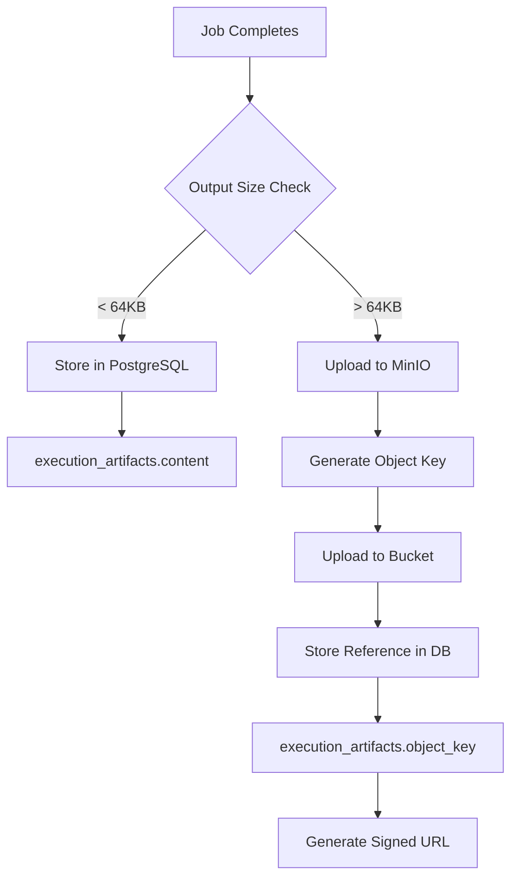
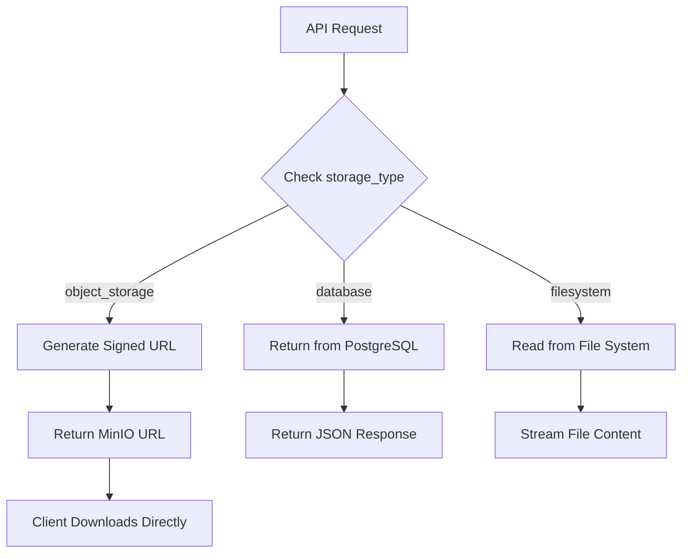

# 🗄️ **OpsConductor Object Storage Architecture**

## 📋 **Overview**

OpsConductor now features a **hybrid storage architecture** combining PostgreSQL databases with S3-compatible object storage (MinIO) for optimal performance, scalability, and cost-effectiveness.

---

## 🏗️ **Storage Decision Matrix**

| Data Size | Type | Storage Location | Database Reference |
|-----------|------|------------------|-------------------|
| **< 64KB** | Text logs, metadata, small configs | **PostgreSQL** | Direct storage in `content` field |
| **64KB - 10MB** | Structured data, medium files | **Object Storage** | `object_key` + `bucket_name` |
| **10MB - 1GB** | Large logs, reports, media | **Object Storage** | `object_key` + `bucket_name` |
| **> 1GB** | Videos, archives, datasets | **Object Storage** | `object_key` + `bucket_name` |

---

## 🔧 **Implementation Details**

### **Database Schema Updates**

#### **Enhanced execution_artifacts Table**
```sql
-- New fields for object storage support
storage_type VARCHAR(20) DEFAULT 'filesystem',     -- filesystem, object_storage, database
file_path TEXT,                                     -- Legacy filesystem path
object_key TEXT,                                    -- S3/MinIO object key
bucket_name VARCHAR(100),                           -- Object storage bucket
storage_url TEXT,                                   -- Full URL for direct access
checksum VARCHAR(64),                               -- SHA256 for integrity
retention_policy VARCHAR(50),                       -- temporary, permanent, archived
expires_at TIMESTAMP WITH TIME ZONE,                -- Auto-cleanup timestamp
```

#### **Object Storage Management Tables**
```sql
-- Bucket configuration and monitoring
object_storage_buckets (
    bucket_name, bucket_type, retention_days,
    max_object_size, total_size_limit, current_size
)

-- Access audit logging  
object_storage_access_logs (
    artifact_id, operation, user_id, bytes_transferred,
    access_time, status_code
)
```

---

## 🪣 **Default Bucket Configuration**

| Bucket | Purpose | Retention | Max Object Size | Total Limit |
|--------|---------|-----------|----------------|-------------|
| **opsconductor-executions** | Job outputs & logs | 365 days | 1 GB | 100 GB |
| **opsconductor-artifacts** | Generated files & reports | 730 days | 5 GB | 500 GB |
| **opsconductor-logs** | Detailed execution logs | 90 days | 100 MB | 10 GB |
| **opsconductor-temp** | Temporary processing data | 7 days | 1 GB | 50 GB |
| **opsconductor-backups** | System & DB backups | 7 years | 10 GB | 1 TB |

---

## 🔄 **Storage Flow Architecture**

### **Job Execution Output Processing**



### **Data Retrieval Flow**



---

## 🛠️ **Configuration**

### **Environment Variables (.env)**
```bash
# MinIO Object Storage
MINIO_ROOT_USER=opsconductor
MINIO_ROOT_PASSWORD=opsconductor_minio_2024_secure
MINIO_ENDPOINT=http://minio:9000
MINIO_SECURE=false
MINIO_REGION=us-east-1

# Storage Thresholds
OBJECT_STORAGE_ENABLED=true
OBJECT_STORAGE_SIZE_THRESHOLD=64KB
OBJECT_STORAGE_BUCKET_PREFIX=opsconductor
```

### **Service Configuration (Execution Service)**
```python
# Object Storage Settings
object_storage_enabled: bool = True
minio_endpoint: str = "http://minio:9000"
minio_access_key: str = "opsconductor"
object_storage_size_threshold: str = "64KB"
object_storage_artifacts_bucket: str = "opsconductor-artifacts"
```

---

## 📡 **API Endpoints**

### **Execution Artifacts**
```bash
# Get execution with all artifacts
GET /api/v1/executions/{execution_id}

# Get specific artifact metadata  
GET /api/v1/executions/{execution_id}/artifacts/{artifact_id}

# Download artifact (generates signed URL for object storage)
GET /api/v1/executions/{execution_id}/artifacts/{artifact_id}/download

# Stream artifact content directly
GET /api/v1/executions/{execution_id}/artifacts/{artifact_id}/stream
```

### **Object Storage Management**
```bash
# List buckets and usage
GET /api/v1/storage/buckets

# Get bucket statistics
GET /api/v1/storage/buckets/{bucket_name}/stats  

# Clean expired objects
POST /api/v1/storage/cleanup

# Generate presigned upload URL
POST /api/v1/storage/upload-url
```

---

## 🔐 **Security & Access Control**

### **Authentication**
- **JWT tokens** required for all object access
- **Signed URLs** with expiration for direct downloads
- **IP-based restrictions** for sensitive artifacts

### **Encryption**
- **Server-side encryption** enabled by default
- **Client-side encryption** for sensitive data
- **TLS encryption** for all transfers

### **Access Auditing**
- **Complete audit trail** in `object_storage_access_logs`
- **User tracking** for compliance
- **Bandwidth monitoring** and rate limiting

---

## 🔄 **Lifecycle Management**

### **Automatic Cleanup**
```sql
-- Objects with expiration dates are automatically cleaned up
SELECT * FROM execution_artifacts 
WHERE expires_at < CURRENT_TIMESTAMP 
AND storage_type = 'object_storage';
```

### **Retention Policies**
- **Temporary files** → 7 days auto-delete
- **Execution logs** → 90 days retention  
- **Job artifacts** → 2 years retention
- **System backups** → 7 years retention

### **Archive Transition**
- **Cold storage** for rarely accessed files
- **Glacier transition** for long-term retention
- **Cost optimization** through intelligent tiering

---

## 📊 **Benefits**

### **Performance**
✅ **Faster database queries** - Large binaries not in PostgreSQL  
✅ **Parallel uploads/downloads** - Direct object storage access  
✅ **CDN integration** - Global content delivery  
✅ **Reduced memory usage** - Streaming instead of loading to memory

### **Scalability**  
✅ **Unlimited storage** - Petabyte-scale capacity  
✅ **Horizontal scaling** - Multiple MinIO instances  
✅ **Multi-region support** - Geographic distribution  
✅ **Auto-scaling** - Dynamic capacity management

### **Cost Efficiency**
✅ **Lower storage costs** - Object storage vs database storage  
✅ **Intelligent tiering** - Hot/cold storage optimization  
✅ **Reduced backup sizes** - Database without large binaries  
✅ **Pay-as-you-use** - Scale costs with usage

### **Reliability**
✅ **Built-in redundancy** - Multiple copies of data  
✅ **Automatic healing** - Self-repairing storage  
✅ **Checksum validation** - Data integrity verification  
✅ **Point-in-time recovery** - Versioning and snapshots

---

## 🚀 **Deployment**

### **Starting the Stack**
```bash
# Start all services including MinIO
docker-compose up -d

# Access MinIO Console
https://localhost:9090
# Login: opsconductor / opsconductor_minio_2024_secure
```

### **Manual Bucket Creation**
```bash
# Using MinIO Client (mc)
mc alias set opsconductor http://localhost:9001 opsconductor opsconductor_minio_2024_secure
mc mb opsconductor/opsconductor-executions
mc mb opsconductor/opsconductor-artifacts
```

### **Health Monitoring**
```bash
# Check MinIO health
curl http://localhost:9001/minio/health/live

# Check bucket usage
docker exec -it opsconductor-minio mc admin info opsconductor
```

---

## 🔍 **Troubleshooting**

### **Common Issues**

**MinIO Connection Refused**
```bash
# Check MinIO service status  
docker logs opsconductor-minio

# Verify network connectivity
docker exec -it opsconductor-execution-service curl http://minio:9000/minio/health/live
```

**Object Upload Failures**
```bash
# Check disk space
docker exec -it opsconductor-minio df -h /data

# Verify bucket permissions
mc admin user info opsconductor opsconductor
```

**Slow Object Access**
```bash
# Monitor network bandwidth
docker exec -it opsconductor-minio iostat -x 1

# Check MinIO performance  
mc admin trace opsconductor --verbose
```

---

## 🎯 **Next Steps**

1. **Implement MinIO SDK** in execution service
2. **Add lifecycle management** scripts  
3. **Setup monitoring** and alerting
4. **Configure backup policies**
5. **Test disaster recovery** procedures

Your OpsConductor platform now has **enterprise-grade object storage** for unlimited, scalable, and cost-effective data management! 🚀